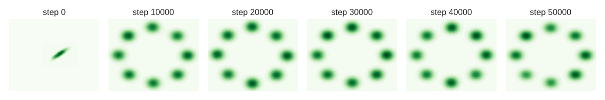

# Prediction GAN #

## Introduction ##
This is a Pytorch implementation of the Prediction method presented in the following paper:

Abhay Yadav, Sohil Shah, Zheng Xu, David Jacobs and Tom Goldstein, [Stabilizing Adversarial Nets With Prediction Methods](https://arxiv.org/abs/1705.07364), ICLR 2018.

If you use this code in your research, please cite our paper.
```
@article{yadav2018stabilizing,
  title={Stabilizing Adversarial Nets With Prediction Methods},
  author={Yadav, Abhay and Shah, Sohil and Xu, Zheng and Jacobs, David and Goldstein, Tom},
  journal={International Conference on Learning Representations},
  year={2018}
}
```

The source code and dataset are published under the MIT license. See [LICENSE](LICENSE) for details. In general, you can use the code for any purpose with proper attribution. If you do something interesting with the code, we'll be happy to know. Feel free to contact us.

## Requirement ##

* [Pytorch](http://pytorch.org/) >= v0.2.0

## Usage ##
Please place [adamPre](adamPre.py) file in the local folder of your project. You can start using AdamPre optimizer by simply importing it and initializing it like any other optimizer in Pytorch.
```
from adamPre import AdamPre
optG = AdamPre(netG.parameters(), lr=0.001, betas=(0.9, 0.999))
```
Once initialized, please appropriately call optG.stepLookAhead() and optG.restoreStepLookAhead() to update network weights using prediction method and to restore back to non-prediction weights respectively.

Please see sample code for [MoG](mogdata.py) to understand the minor details. This code also reproduces the result in Figure 8 of the paper. One can start training from the console as follow:
```
$python main.py --pdhgGLookAhead --cuda --outf results/ --manualSeed 6162 --plotLoss --plotRealData
```


## Other Implementations ##
* [PyTorch Implementation](https://github.com/sanghoon/prediction_gan) with other optimizers + sample experimental results on DCGAN network.
